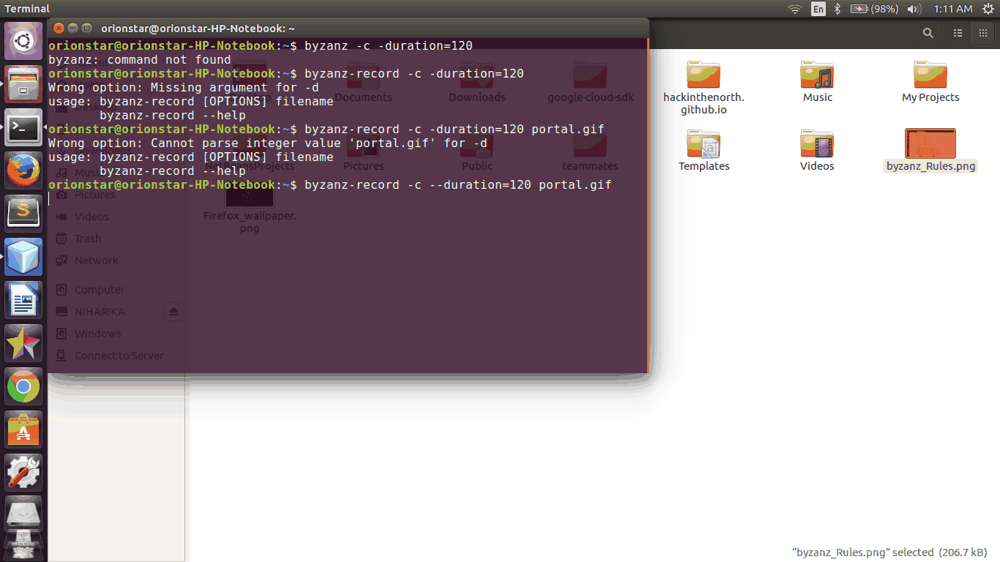

Hello all! This is a GUI- based portal written in Java using swing. Its features are :-

1) Takes marks as input from teachers and stores in a batch and computes grades based on various parameters. 
2) Displays marks of all students whose entry is in the database. Marks can be modified, records can be deleted, and other results can be shown on entering the correct roll number.

For executing it :

1) Compile Result.java.
2) Enter roll number and marks in respective fields. Assignments and exams are of 100 marks each. p1,p2,p3 are percentages above which you want a certain grade.
3) Click DONE to add them in the database.
4) Add more if you like.
5) Click SHOW to show results.
6) Enter roll number in the search bar and search. It shows results with grade if it exists else shows nothing.
7) Click DELETE to delete a record.
8) Modify fields and click SEARCH again and data will be modified.

Check out the demo video! 

